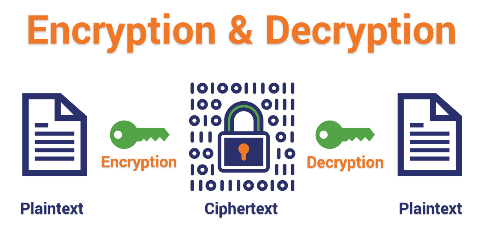
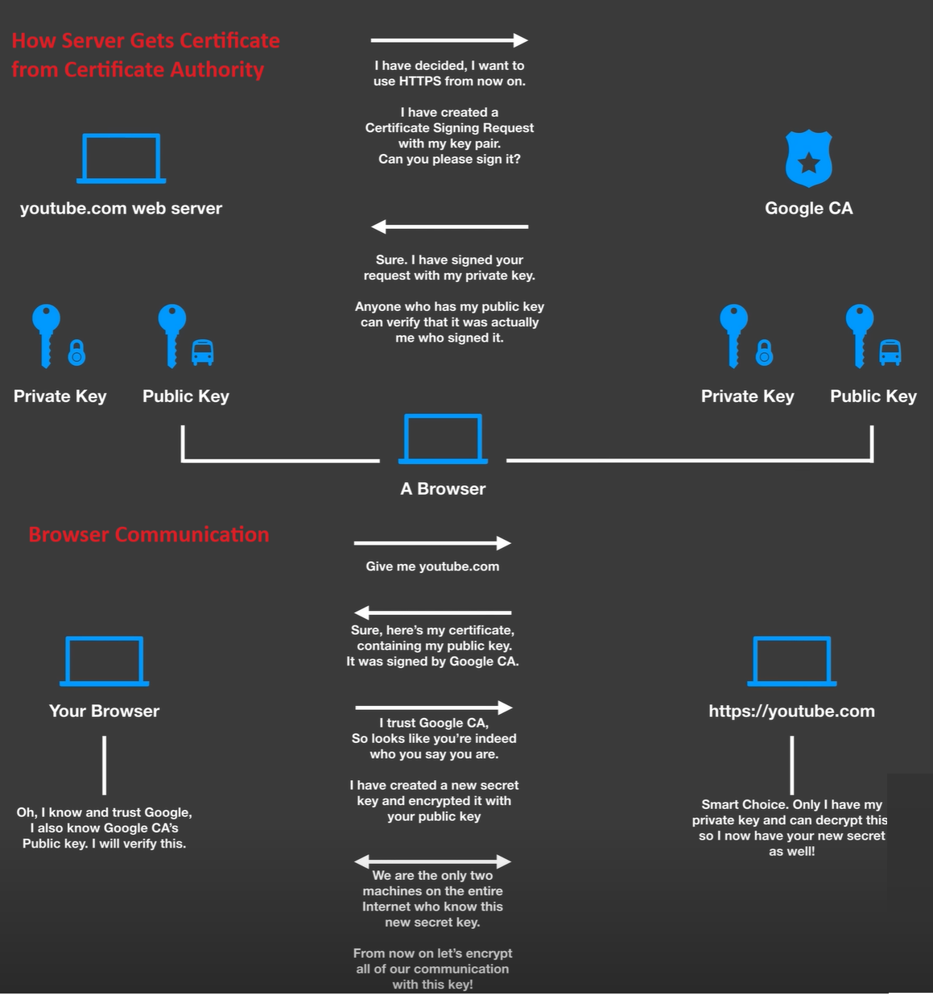
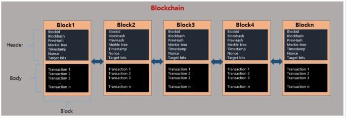
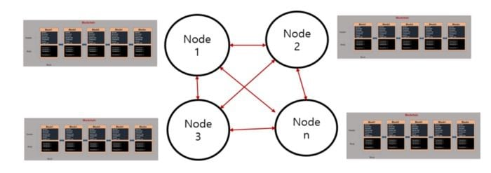
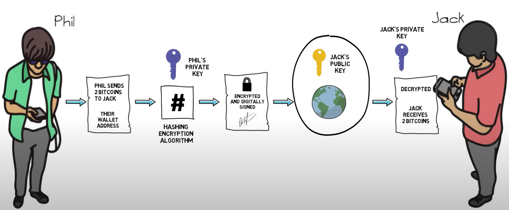

# Web3

## Table of Content
1. [Overview](#overview)
2. [History](#history)
3. [Modules](#modules)
4. [Glossary](#glossary)
5. [References](#references)

## Overview
- Web 3.0 in the next/future iteration of the internet that aims to revolutionize how we interact, transact, and share information online.
- Key aspects:
  - Decentralization
  - Distributed Ledger
  - User Control and Privacy
  
- To learn Blockchain or Web3, we need below tool kits
  - **Framework:**
    - `Ethereum`: 
      - It is one of the most well-known blockchain platforms, primarily utilized for creating smart contracts and decentralized applications.
      - It introduced the concept of programmable smart contracts, enabling developers to build decentralized applications on its blockchain.
      - Its blockchain uses a consensus mechanism called Proof of Stake (PoS), aiming to transition from the current energy-intensive Proof of Work (PoW).
    - `Solana:` 
      - It is a high-performance blockchain platform designed for decentralized applications (dApps) and crypto projects.
      - It aims to provide fast transaction speeds and low fees through its unique technological approach called Proof of History (PoH) combined with Proof of Stake (PoS).
    - `Hyperledger:` 
      - It isn’t a single blockchain but a collection of open-source frameworks and tools for building enterprise-grade blockchain solutions.
      - It’s hosted by the Linux Foundation.
      - It has projects like Fabric, Sawtooth, Indy, and Besu offer modular frameworks suitable for different use cases in industries such as finance, supply chain, healthcare, and more.
      - Unlike Ethereum/Solana it is often used for permissioned networks, meaning access is restricted to certain participants, providing privacy and control.
  - **Programming Language:**
    - `Rust:` 
      - It is a systems programming language that prioritizes safety, speed, and concurrency.
      - Solana is known for its use of the Rust programming language in its development.
      - Solana's core software, including its blockchain protocol and ecosystem tools, is built using Rust.
    - `Solidity:`
      - It is the programming language primarily used for developing smart contracts on the Ethereum blockchain.
      - Smart contracts written in Solidity are deployed and executed on the Ethereum Virtual Machine (EVM).
    - `Chaincode:`
      - It refers to the term often used in the context of Hyperledger Fabric, which represents the smart contracts or business logic deployed and executed on a Hyperledger Fabric network.
      - Chaincode is written in programming languages such as Go, Node.js, or Java and is installed and invoked on the Hyperledger Fabric network by network participants to perform specific functions or execute transactions.

## History
- The world of `Blockchain` started with the crypto currency `Bitcoin` based on paper available [here](https://bitcoin.org/bitcoin.pdf).
  - It works on below foundation principles:
    - **Cryptography:** 
      - It is the process of hiding or coding information so that only the person a message was intended for can read it.
      - Different encryption algorithms are used to convert plain text into cypher text. These techniques are called encryption and decryption.
      
      - There are different types of Cryptography encryption techniques: Symmetric, Asymmetric and Hashing.
        - Symmetric encryption uses the same keys to encrypt and decrypt. Asymmetric encryption uses public and private keys to encrypt and decrypt.
        
      - It has the below building blocks:
        - `Public & Private Key:`
          - `Public Key:` 
            - This is shared with everyone. 
          - `Private Key:`
            - This is not shared with everyone and is kept as a secret.
          - `Confidentiality:`
            - Client/Sender will encrypt the data he wants to send using the available public key.
            - This will allow only the Server/Consumer with a valid private key to read the data and ensure the data packets are not tampered with.  
          - `Signature:`
            - Server/Consumer will encrypt data that he wants to send using his secret private key.
            - This can be decrypted using the public key available ensuring the data is received only from the Server/Consumer and not tampered with.

          
        - `Algorithm:`
          - Algorithms are the rules or instructions for the encryption process. 
          - The key length, functionality, and features of the encryption system in use determine the effectiveness of the encryption. Typically the length of keys ranges from 128 to 256 bits.
          - An encryption key is a randomized string of bits used to encrypt and decrypt data. The longer keys are harder to break.
          - `RSA - Rivest Shamir Adleman:`
            - It is a public-key encryption algorithm and the standard for encrypting data sent over the internet.
            - RSA is an asymmetric algorithm because it uses a pair of keys.
            - It uses the public key to encrypt the message and a private key to decrypt it.
            - It is widely used in securing data transmission, authentication, and digital signatures. It's particularly efficient for securing communications over the Internet.
            - HTTPS - SSL uses RSA.
          - `SHA - Secure Hashing Algorithm:`
            - It is the common name for a family of cryptographic hash functions.
            - It is used to generate a fixed-size hash value (digest) from input data of variable length.
            - Bitcoin uses SHA-256.
    - **Distributed Ledger:**
      - Ledger refers to the bookkeeping of all the transactions that take place in an organization or a business unit.
      - Traditionally banks or online platforms use databases to store this data to indicate movements of resources like money, goods etc.. between registered parties. These are prone to hacking and unauthorised transactions creating a trustless eco-system.
      - To solve this problem a free market ideology called `Bitcoin` was invented in `2008 by Satoshi Nakamoto`, an unknown person. The use of Bitcoin as a currency `began in 2009`, with the release of its `open-source implementation`.
        - `Nodes:` These are computation building blocks that create peer-to-peer networks to verify transactions through cryptography and record them in a public distributed ledger.
        - `Mining:` Consensus between nodes on the final list of transactions is achieved using a computationally intensive system based on proof-of-work.
        - `Block:` 
          - It contains information on transactions like names, places, times, cost, previous block hash, current block hash, Markle tree and block ID, etc or any other type of data. 
          - These blocks cannot be deleted or updated once created.
        - `Blockchain:`
          - Individual blocks are cryptographically verified and chained up to form an immutable chain called a blockchain.
          - The same chain is then distributed to all the nodes across the network via a P2P network.
          - Instead of a centralized database, all the transactions (data) that are shared across the nodes are contained in blocks, which are chained together to create the ledger.
          - All the data in the ledger is secured by cryptographic hashing and digital signature and validated by a consensus algorithm. 
          - Nodes on the network participate to ensure that all copies of the data distributed across the network are the same.

        
        
        

## Modules
- [Rust](./02-modules/rust.md)
- [Solana](./02-modules/solana.md)

## Glossary
- **DeFi:** Decentalized Finance
- **DAO's:** Decentalized Autonomus Organizations
- **DApp:** Decentalized Application
- **NFT:** Non Fudgable Tokens
- **Blockchain:** It is a collaboration-enabling technology that replaces `brand-based trust` with `math-based trust` by shifting the hosting, execution, enforcement, and custody mechanisms of a contract to software logic run across a decentralized network that no individual participant can undermine. `Trust Minimized Agreements`
- **Blockchain Oracle:** These are entities that connect blockchains to external systems, thereby enabling smart contracts to execute based on inputs and outputs from the real world. More details available [here](https://chain.link/education/blockchain-oracles#types-of-blockchain-oracles)
- **Hybrid Smart Contracts:** It combines code running on the blockchain (on-chain) with data and computation from outside the blockchain (off-chain) provided by decentralized oracle networks.

## References
- [Why Solana](https://www.investopedia.com/solana-5210472)
- [Harkirat Singh - Inspiration](https://www.youtube.com/watch?v=ERAxd8gl1Eg&list=PLVKLWop9wWA9n9NQZ2GURoB_a1gOezN_e&index=3)
- [DApp University - Inspiration](https://www.youtube.com/watch?v=VH9Q2lf2mNo), [one more](https://www.youtube.com/watch?v=jcgfQEbptdo)
- [Security Auditing] (https://github.com/Cyfrin/security-and-auditing-full-course-s23), [one more](https://updraft.cyfrin.io/courses/security), [home site](https://updraft.cyfrin.io/)
- [Hyperledger](https://www.hyperledger.org/)
- [Freecodecamp - Learn Blockchain](https://www.youtube.com/watch?v=gyMwXuJrbJQ)
- [Local Blockchain - Truffle Ganache](https://trufflesuite.com/ganache/)
- [Connect to Blockchain - Metamask](https://metamask.io/)